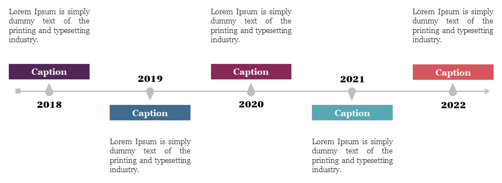

# Dein sehr langer Projekttitel steht hier (gerne richtig lang)

Ein Apple-artiger 1–2 Satz Teaser: Problem → Approach → Contribution.

  <a class="badge" href="LINK_ZUM_PAPER.pdf">📄 Paper</a>
  <a class="badge" href="LINK_ZUM_CODE">💻 Code</a>
  <a class="badge" href="LINK_ZUM_VIDEO">🎬 Video</a>
  <a class="badge" href="LINK_ZUM_DATASET">🧩 Dataset</a>

## Timeline

## Introduction

Hier kommt dein Introtext. Apple-ish wirkt am besten mit:
- kurzen Absätzen
- klaren Statements
- wenig “Wall of Text”

## Video

<iframe width="100%" height="520"
  src="https://www.youtube.com/embed/VIDEO_ID"
  title="Project video"
  frameborder="0"
  allow="accelerometer; autoplay; clipboard-write; encrypted-media; gyroscope; picture-in-picture; web-share"
  allowfullscreen>
</iframe>

Optionaler 1-Satz Kontext: Was sieht man im Video?

## Results

**Status:** 1–2 Sätze.

**Key outcomes:**
- Ergebnis 1
- Ergebnis 2
- Ergebnis 3

**Next steps:**
- Punkt 1
- Punkt 2

## Repositories

  <a href="REPO_URL_1">
    
h-jepa-core

    
Core architecture • training

    
Hover-Text: Kurzbeschreibung der Repo-Inhalte.

  </a>

  <a href="REPO_URL_2">
    
babyai-experiments

    
Simulation • evaluation

    
Hover-Text: Experimente, Baselines, Metrics.

  </a>

  <a href="REPO_URL_3">
    
robot-transfer

    
Robotics • deployment

    
Hover-Text: Deployment, sim2real, interfaces.

  </a>

  <a href="REPO_URL_4">
    
docs-and-assets

    
Figures • writing

    
Hover-Text: Diagramme, Plots, Writing assets.

  </a>

## Papers

  <a href="PAPER_LINK_1">
    
Paper Title 1 (2026) — Venue optional

    
Julian Quast, Coauthor A, Coauthor B

    
Hover-Text: 2–4 Zeilen Abstract/Teaser.

  </a>

  <a href="PAPER_LINK_2">
    
Paper Title 2 (2025)

    
Julian Quast

    
Hover-Text: Kurzabstract / Beitrag in 2–4 Zeilen.

  </a>

