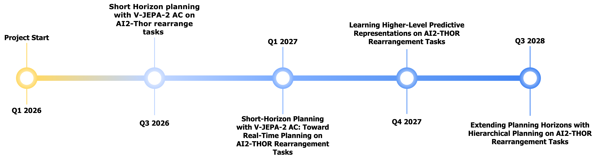

---
hide:
  - toc
  - navigation
---

<h1>
Long-Horizon Real-Time Planning with Hierarchical Joint Embedding Predictive Architectures
</h1>

  Julian Quast
  <a class="author-link"
     href="https://www.linkedin.com/in/julian-quast-1a4068292/"
     target="_blank"
     aria-label="LinkedIn profile">

    <svg xmlns="http://www.w3.org/2000/svg"
         width="22"
         height="22"
         viewBox="0 0 24 24"
         fill="#0A66C2">

      <path d="M19 3A2 2 0 0 1 21 5V19A2 2 0 0 1 19 21H5A2 2 0 0 1 3 19V5A2 2 0 0 1 5 3H19M8.34 17V10.5H6V17H8.34M7.17 9.43C7.93 9.43 8.5 8.86 8.5 8.1C8.5 7.34 7.93 6.77 7.17 6.77C6.41 6.77 5.84 7.34 5.84 8.1C5.84 8.86 6.41 9.43 7.17 9.43M18 17V13.5C18 11.57 17.11 10.3 15.27 10.3C14.36 10.3 13.8 10.8 13.57 11.28V10.5H11.34C11.37 11.04 11.34 17 11.34 17H13.68V13.36C13.68 13.17 13.69 12.98 13.75 12.84C13.9 12.46 14.25 12.07 14.83 12.07C15.6 12.07 15.91 12.64 15.91 13.48V17H18Z"/>
    </svg>

  </a>

<!-- 

  <a class="hero-badge" href="#timeline">Timeline</a>
  <a class="hero-badge" href="#repositories-papers">Papers & Repositories</a>
  

 -->

  

    <iframe
      src="https://www.youtube.com/embed/YxkGdX4WIBE?start=17"
      title="Project video"
      frameborder="0"
      allow="accelerometer; autoplay; clipboard-write; encrypted-media; gyroscope; picture-in-picture; web-share"
      allowfullscreen>
    </iframe>
  

World models play an increasingly important role in modern embodied AI (Ha et al., 2018; Hafner
et al., 2023; Zhou et al., 2024; Bruce et al., 2025; Assran et al., 2025; Pu et al., 2025). They enable
agents to internally predict the consequences of their actions, allowing them to plan and learn
policies based on imagined future trajectories. In parallel, driven by recent advances in large-scale
self-supervised representation learning—grounded in transformer architectures (Vaswani et al.,
2017) and foundation-model pretraining—embodied AI is increasingly adopting general-purpose
visual encoders such as DINOv2 (Oquab et al., 2023). These models show promising results
on several downstream control tasks and in addressing generalization challenges (Zhou et al.,
2024; Assran et al., 2025; Bu et al., 2025). With DINO-WM, Zhou et al., 2024 introduced a
world model that combines a pretrained DINOv2 encoder with an action-conditioned predictor.
This architecture performs planning directly in the embedding space and demonstrates zero-shot
planning capabilities on multiple benchmarks.
Despite these advances, most state-of-the-art models still require labeled interaction data to
learn action-conditioned dynamics and control policies (Hafner et al., 2023; Hansen et al., 2023;
Zhou et al., 2024; Assran et al., 2025). Since internet-scale action-labeled datasets are scarce
and costly to acquire, while raw video is abundant, this reliance on labeled actions limits the
scalability of world models compared to purely visual pretraining. Moreover, a truly foundational
world model should operate across diverse environments and embodiments. This would require
a unified action representation abstracting over embodiment-specific control interfaces, which
is often impractical or ill-posed, as action semantics are tightly coupled to physical structure
and actuation. As a result, reliance on explicit action labels further limits generalization and
transfer (Bu et al., 2025). In response to this limitation, current work on latent action models
learns implicit action representations from observations alone, typically via inverse dynamics.
These models encode the changes between consecutive observations into a compact latent action,
most often using a VAE- or VQ-VAE–based approach (Kingma et al., 2013; Oord et al., 2017;
Bruce et al., 2025; Gao et al., 2025). Such latent actions can then serve as a control interface for
downstream tasks, and several works have demonstrated successful planning and policy learning
using these representations (Schmidt et al., 2023; Bu et al., 2025; Ye et al., 2024a; Zhang et al.,
2024; Gao et al., 2025; Bruce et al., 2025). However, these methods often rely on pixel-space
reconstruction losses rather than learning directly in embedding space, and they usually train the
latent action model separately from the world model or policy. This separation also means that
decoders are discarded during downstream use, disconnecting learned latent actions from the
planning and control components (Gao et al., 2025; Bruce et al., 2025). Furthermore, many latent
action approaches focus on training policies rather than enabling explicit model-based planning.
Once the policy is trained, incorporating new task information usually requires retraining the
entire system, whereas learning a dynamics model would allow task optimization at inference
time without additional training (Bu et al., 2025; Schmidt et al., 2023; Ye et al., 2024a).
In this thesis, we investigate whether the benefits of pretrained visual embeddings and model-
based planning can be combined with latent action learning. Concretely, we build on a publicly
available, pretrained visual encoder and propose a variant of DINO-WM that jointly learns a
1
forward dynamics model and an inverse dynamics model directly in the learned embedding space.
This design enables pretraining the model without ground-truth action labels while reducing the
number of learned components. The forward model predicts future DINO embeddings conditioned
on latent actions, while the inverse dynamics model maps pairs of consecutive embeddings to
latent actions. Training couples these components so that inferred latent actions are directly
optimized for forward prediction. Planning is performed in the latent action space using a CEM
optimizer (Rubinstein, 1999). This motivates the central research question of this thesis: Can our
proposed latent action version of DINO-WM, trained with joint forward and inverse dynamics,
match the planning performance of the original model on the PushT benchmark?
To answer this question, we review inverse dynamics architectures and use the resulting insights
to propose our variant of DINO-WM. We then empirically analyze how the introduction of latent
actions into the pipeline a"ects its behavior. In particular, we analyze and compare prediction
quality, planning performance, and the e"ect of actions and latent actions on prediction for our
variants relative to the baseline. We additionally evaluate the decodability of the learned latent
actions into ground-truth action labels. This thesis is structured as follows. We first provide
the scientific background for our approach and review related work and alternative methods.
We then introduce our proposed architecture in detail. Next, we describe our experimental
setup, covering dataset curation, the chosen benchmark, training and implementation details,
and the conducted experiments. We then present and discuss our empirical results. Finally, we
summarize the contributions and limitations of our approach and outline promising directions
for future work.

  <h2>Papers & Repositories</h2>
  

    Publications and codebases connected to the research direction.
  

  

  <!-- Second paper tile -->
  

    

    

      <a class="paper-title" href="PAPER_LINK_2">
        Action-Label-Free World-Model Planning: Extending DINO-WM with Inverse Dynamics
      </a>

      

        <a class="paper-badge" href="assets/papers/Abschlussarbeit_0450764.pdf">Thesis</a>
        <a class="paper-badge" href="https://github.com/pythonpedro99/dino_wm_latent_actions">Code</a>
      

    

  

  
  

    

    

      <a class="paper-title" href="PAPER_LINK_1">
        Short Horizon planning with V-JEPA-2 AC on AI2-Thor rearrange tasks
      </a>

      

        <a class="paper-badge" href="PAPER_LINK_1">Paper</a>
        <a class="paper-badge" href="REPO_URL_1">Code</a>
        Coming soon
      

    

  

  

